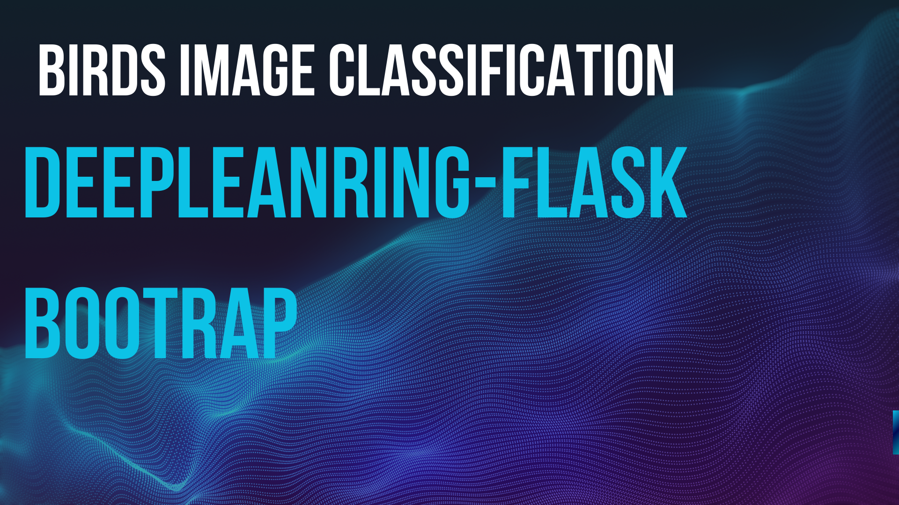

   
    
   

  

    
    
    
    
    
    
  

  <h3 align="center">Birds Image Classification Web App</h3>

  

    Experience the power of AI with our Birds Image Classification Web App. This application leverages machine learning to accurately classify various bird species from images. It provides a user-friendly platform for bird enthusiasts and researchers alike to effortlessly identify birds with precision.
  

## 📋 <a name="table">Table of Contents</a>

1. 🦜 [Introduction](#introduction)
2. ⚙️ [Tech Stack](#tech-stack)
3. 🔋 [Features](#features)

## 🚨 About 

This project is a SaaS web application that classifies bird species using a trained AI model. Here is the demo of [Birds Image Classification](demoimageclassification).

## <a name="introduction">🦜 Introduction</a>

Discover the fascinating world of birds with our Birds Image Classification Web App. This intuitive application uses advanced AI algorithms to classify different bird species from uploaded images. Perfect for bird watchers, researchers, and hobbyists, it simplifies bird identification and enhances your bird-watching experience.

## <a name="tech-stack">⚙️ Tech Stack</a>

- Python
- Flask
- Bootstrap
- HTML
- CSS
- PyTorch

## <a name="features">🔋 Features</a>

👉 **Modern User Interface**: A sleek, user-friendly interface that provides an enjoyable user experience.

👉 **Bird Image Classification**: Users can upload images of birds, and the web app utilizes AI to classify the bird species with high accuracy.

👉 **History Saving with Local Storage**: Users can save their classification history locally, making it easy to revisit and manage their previous classifications.

👉 **Copy to Clipboard Functionality**: Allows users to copy classification results to their clipboard for easy sharing and documentation.

👉 **Efficient API Requests**: Utilizes Flask for efficient backend operations, ensuring fast and reliable data processing and management.

Enjoy a seamless and informative experience with our Birds Image Classification Web App, where technology meets nature.
